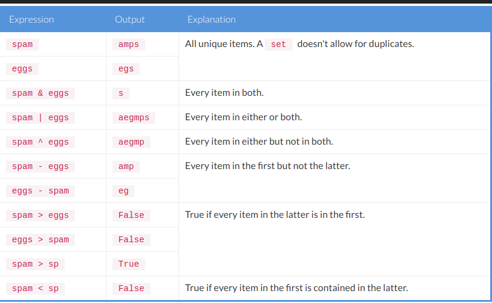

# NOTAS DEL LIBRO MASTERING PYTHON

**Usamos python3**

## Chapter 1 - Getting Started – One Environment per Project

#### Creating a virtual Python environment using venv

#### Bootstrapping pip using ensurepip

#### Installing C/C++ packages

Cuando se hacen instalaciones de paquetes de Python que dependen de otras
dependencias y se generan errores como el siguiente:

    x86_64-linux-gnu-gcc: error: build/temp.linux-x86_64-3.4/libImaging/Jpeg2KDecode.o: No such file or directory
    x86_64-linux-gnu-gcc: error: build/temp.linux-x86_64-3.4/libImaging/Jpeg2KEncode.o: No such file or directory
    x86_64-linux-gnu-gcc: error: build/temp.linux-x86_64-3.4/libImaging/BoxBlur.o: No such file or directory
    error: command 'x86_64-linux-gnu-gcc' failed with exit status 1

    ----------------------------------------
	Command "python3 -c "import setuptools, tokenize;__file__='/tmp/pip-build-_f0ryusw/pillow/setup.py';exec(compile(getattr(tokenize, 'open', open)(__file__).read().replace('\r\n', '\n'), __file__, 'exec'))" install --record /tmp/pip-kmmobum2-record/install-record.txt --single-version-externally-managed --compile --install-headers include/site/python3.4/pillow" failed with error code 1 in /tmp/pip-build-_f0ryusw/pillow

El truco para encontrar el error esta en buscar los mensajes acerca de los 'headers' no encontrados:

	n file included from libImaging/Imaging.h:14:0,
                   from libImaging/Resample.c:16:
  	libImaging/ImPlatform.h:10:20: fatal error: Python.h: No such file or directory
   	#include "Python.h"
                      ^
  	compilation terminated.

En este caso el header **Python.h** no fue encontrado. Este es necesario para la compilación
de paquetes C/C++ dentro de Python. Para solucionar este caso en Ubuntu:

	$ sudo apt-get install python3-dev

## Chapter 2. Pythonic Syntax, Common Pitfalls, and Style Guide

El desarrollo de Python siempre ha estado en manos de su creador Guido van Rossum, quien es llamado
Benevolent Dictator For Life (BDFL).

Para ayudar al DBFL en el mantenimiento y desarrollo de Python se creo el proceso: 
**Python Enhancement Proposal (PEP)** (Propuesta de mejora de Python). Este proceso permite a
cualquier persona enviar un PEP con una especificación técnica de la característica y una
justificación para defender su utilidad. Después de una discusión sobre las listas de correo de
Python y posiblemente algunas mejoras, la BDFL tomará la decisión de aceptar o rechazar la propuesta.

#### Code style – or what is Pythonic code?

La filosofía del PEP 20 dice que el código debe ser:
- Limpio
- Simple
- Lindo
- Explicito
- Legible

#### Formatting strings – printf-style or str.format?

Python ha sido compatible con los estilos:

	printf-style (%)

y

	str.format

En general la mayoria de las personas recomiendan *str.format*, pero esto esta sujeto a las preferencias
de cada persona. *printf-style* es mas simple, pero *str.format* es mas poderoso.

- Para aprender más acerca de PyFormat visitar https://pyformat.info/

#### PEP20, the Zen of Python

---------------------- * -----------------

#### Maximum line length

Para mantener la regla de los 79 caracteres hay que pensar en refactorizar el código de forma que se vea mejor
y de una forma más 'pythonic'. Ejemplos:

Usando el backslash:

	with open('/path/to/some/file/you/want/to/read') as file_1, \
        	open('/path/to/some/file/being/written', 'w') as file_2:
    	file_2.write(file_1.read())

En lugar de backslash:

	filename_1 = '/path/to/some/file/you/want/to/read'
	filename_2 = '/path/to/some/file/being/written'
	with open(filename_1) as file_1, open(filename_2, 'w') as file_2:
    	file_2.write(file_1.read())

O puede ser:

	filename_1 = '/path/to/some/file/you/want/to/read'
	filename_2 = '/path/to/some/file/being/written'
	with open(filename_1) as file_1:
	    with open(filename_2, 'w') as file_2:
	        file_2.write(file_1.read())

No siempres es una opción, pero es bueno tenerlo en cuenta y mantener el código corto y legible.

#### Verifying code quality, pep8, pyflakes, and more

Algunas herramientas que verificán el código son:
	
1. flake8
2. PEP8
3. pyflakes
4. McCabe
5. Pylint

### Common pitfalls

#### Scope matters!
Con la función:
	
	def spam(key, value, list_=[], dict_={}):
	    list_.append(value)
	    dict_[key] = value

	    print('List: %r' % list_)
	    print('Dict: %r' % dict_)

	spam('key 1', 'value 1')
	spam('key 2', 'value 2')

se espera obtener:
	
	List: ['value 1']
	Dict: {'key 1': 'value 1'}
	List: ['value 2']
	Dict: {'key 2': 'value 2'}

Pero se obtiene:
	
	List: ['value 1']
	Dict: {'key 1': 'value 1'}
	List: ['value 1', 'value 2']
	Dict: {'key 1': 'value 1', 'key 2': 'value 2'}

La razón es que list_ y dict_ en realidad se comparten entre varias llamadas. **Por lo tanto
se debe evitar usar objetos mutables como parámetros predeterminados en una función**.

La forma segura es la siguiente:
    
    def spam(key, value, list_=None, dict_=None):
        if list_ is None:
            list_ = []

        if dict_ is None:
            dict_ = {}

        list_.append(value)
        dict_[key] = value

#### Class properties (Propiedades de Clase)

El problema ocurre cuando se definen clases. Es muy facil mezclar los atributos de clase con los
atributos de instancia.

Ejecutar el script: class_properties.py

Como se puede ver las listas y los diccionarios son compartidos.

Una mejor solución es inicializar los objetos mutables dentro del metodo **__init__.py** de la clase.
Así estos no serán compartidos entre las clases.

Ver: class_properties.Spam2

Como se puede ver al ejecutar el script: *class_properties.py* se definene dos objetos *Spam* en el
primer caso se comparten los datos de los atributos: list_ y dict_, lo cual no es lo deseado ya se quiere
generar dos instancias diferentes, pero en la clase Spam2 estos mismos atributos quedan independientes
para cada instancia.

Otro asunto importante cuando se manejan propiedades de clase es la herencia. Al heredar las propiedades de
clase permanecerán (a menos que se sobreescriban) incluso en las subclases.

Ejemplo:

	>>> class A(object):
	        spam = 1

	>>> class B(A):
	        pass

	# En esta herencia el atributo spam tanto de A como de B es: 1.

	>>> A.spam
	1
	>>> B.spam
	1

	# Pero si se modifica A.spam=2 tambien modifica B.spam

	>>> A.spam = 2
	>>> A.spam
	2
	>>> B.spam
	2

Aunque esto es lo esperado debido a al herencia, una persona que use esta clase no sospechara que la variable
cambie, ya que se modifico A y no B.

Hay dos maneras de solucionar esto:

1. La más obvia es modificar la propiedad _spam_ para cada clase.

2. **Una mejor solucón es nunca modificar las propiedades de clase**. Es muy facil olvidar que una propiedad
cambión e multiples ubicaciones, y si esta de todas formas debe cambiar lo mejor es usar variables de
instancia.

#### Modifying variables in the global scope

Esto funciona:

	>>> def eggs():
	        print('Spam: %r' % spam)

	>>> eggs()
	Spam: 1

Pero esto no:

	>>> spam = 1

	>>> def eggs():
	...     spam += 1
	...     print('Spam: %r' % spam)

	>>> eggs()
	Traceback (most recent call last):
	    ...
	UnboundLocalError: local variable 'spam' referenced before assignment

El problema es que **spam += 1** traduce a: spam = spam + 1, y cualquier cosa contenida en *spam =*
esta a esta variable local. Entonces como esta varible fue asignada en este punto, esta aun no tiene
ningún valor y se esta tratando de usar. Para estos casos existe la sentencia: **global**.Sin embargo
no se recomienda el uso de variables globales.

La palabra reservada **global** permite modificar una varible fuera del scope actual. Se usa para crear
una variable global y poder modificarla en un contexto local.

Reglas del keyword **global**:
1. Cuando se crea un variable dentro de una función, esta es local por defecto.
2. Cuando se define una variable fuera de una función esta es global por defecto. No es necesario usar
el keyword **global**.
3. Se usa **global** para leer y escribir sobre una varible global dentro de una función.
4. Usar **global** fuera de una función no tiene efecto.

Ejemplo:

	c = 0 # global variable

	def add():
	    global c
	    c = c + 2 # increment by 2
	    print("Inside add():", c)

	add()
	print("In main:", c)

**Solo se puede leer una varible globlal dentro de una función, para escribir sobre ella hay que usar _global_**.

### Overwriting and/or creating extra built-ins

Aunque puede ser útil en algunos casos, no es recomendable sobrescribir variables globales.

En esta sección se describe como crear variables globales y usarlas como si fueran predeterminadas de python.

Lo unico que puedo rescatar es que si es necesario usar los mismos nombres de palabras reservadas lo mejor
es colocar un guion bajo al final:

	list_
	dict_

### Modifying while iterating (Modificando mientras iterando)

En algún momento es posible encontrarse con este problema: Mientras se esta iterando atravez de un
objeto mutable como una lista, un diccionario, o un conjunto (set), **no es posible modificar este objeto**.
Al intentarlo resultara en un error **RuntimeError** indicando que no es posible modificar el objeto
durante la iteración.

Ejemplo:

	dict_ = {'spam': 'eggs'}
	list_ = ['spam']
	set_ = {'spam', 'eggs'}

	for key in dict_:
	    del dict_[key]

	for item in list_:
	    list_.remove(item)

	for item in set_:
	    set_.remove(item)

Esto se puede evitar copiando el objeto. La opción más conveniente es usar la función **list()**.

	dict_ = {'spam': 'eggs'}
	list_ = ['spam']
	set_ = {'spam', 'eggs'}

	for key in list(dict_):
	    del dict_[key]

	for item in list(list_):
	    list_.remove(item)

	for item in list(set_):
	    set_.remove(item)

### Catching exceptions – differences between Python 2 and 3

Con Python 3, capturar una excepción y almacenarla se puede realizar con la sentencia **as**. El
inconveniente es que muchas personas aun usan la sintaxis **except Exception, variable**, la que no
se usa mas. Por suerte la sintaxis de Python 3 ha sido portada a Python 2, así que ahora se puede
hacer lo siguiente:

	try:
    ... # do something here
	except (ValueError, TypeError) as e:
	    print('Exception: %r' % e)

Otra importan diferencia es que Python 3 hace esta variable local al alcance (scope) de la excepción. Como
resultado se debe declarar la variable de excepción antes del bloque **tyr / except** si se quiere
usar después.

	>>> def spam(value):
            try:
                value = int(value)
            except ValueError as exception:
                print('We caught an exception: %r' % exception)

            return exception

	
	>>> spam('a')
	We caught an exception: ValueError("invalid literal for int() with base 10: 'a'",)
	Traceback (most recent call last):
	  File "<stdin>", line 1, in <module>
	  File "<stdin>", line 6, in spam
	UnboundLocalError: local variable 'exception' referenced before assignment

Se podría esperar que lo anterior funcione, pero no lo hace. Porque **exception** no existe en el
punto de la sentencia **return**.

Es necesario guardar el valor de **exception** explícitamente ya que Python 3 elimina cualquier cosa
guardada como **as variable** al final de una sentencia **except**.

Para que este código funcione:

	def spam(value):
	    exception = None
	    try:
	        value = int(value)
	    except ValueError as e:
	        exception = e
	        print('We caught an exception: %r' % exception)

	    return exception

### Circular Imports

Aunque Python es muy tolerante con las importaciones circulares existen casos en los que se pueden
presentar errores.

Ejemplo:
Se tiene los archivos: **eggs.py** y **spam.py** (ver la carpeta scripts)

Ejecutando el archivo **spam.py** se obtiene un error **import**.

Existen varias posible soluciones para esto:

1. Reestructurar el código es generalmente la mejor solución, pero la mejor solución depende del problema.
En el presente caso se podría solo importar los módulos en lugar de las funciones.
(ver **eggs1.py** y **spam1.py**)

2. Otra alternativa es mover los imports dentro de las funciones. No es la solución más bonita pero
funciona en muchos casos. (Ver **eggs2.py** y **spam2.py**). **Hay un error en esta solución
planteada por el libro en el archivo spam2.py linea 8 se llama a la función eggs2.py pero esta se
encuentra dentro del scope de spam2() por eso no funciona.**

3. Por ultimo existe la solución de mover los imports debajo del código que los usa. Esto no es
recomendable porque causa confusión acerca de donde están los imports. El autor prefiere tener los
imports dentro de las funciones que los usan. (Ver **eggs3.py** y **spam3.py**)

### Import collisions

--------- * ---------------

## Chapter 3. Containers and Collections – Storing Data the Right Way

Python viene con muchas colecciones muy útiles, algunas de las cuales son tipos básicos de Python,
el resto son combinaciones avanzadas de estos tipos.

1. Estructuras básicas de datos:
	- list
	- dict
	- set
    - tuple

2. Colecciones mas avanzadas:
* Tipos de diccionarios
	- ChainMap
	- Counter
	- DefaultDict
	- OrderedDict

* Tipos de listas
	- Deque
	- Heapq

* Tipos de tuplas
	- NamedTuple

* Tipos Ordenados
	- Enum

### Time complexity - The big O notation

La notación Big O se refiere a la cantidad de pasos que le toma a una función ser ejecutada.

Cuando se dice que una función toma **O(1)**, quiere decir que en general solo le toma un paso para
ser ejecutada. Igualmente una función con **O(n)** quiere decir que le toma **n** pasos para ser
ejecutada, donde generalmente **n** es el tamaño o lardo del objeto.

El proposito de este sistema es es indicar el rendimiento aproximado de una operación, esto no tiene
que ver con la velocidad de ejecución pero es muy relevante al momento de elegir un algoritmo para
trabajar (hay que comprobar la notación Big O para cada algoritmo)

Para ilustrar **O(1)**, **O(n)** y **O(n\*\*2)**, ver: big_o.py

### Core Collections

#### list – a mutable list of items

Las listas son un tipo de colección muy simple de usar y que en general ofrecen un buen rendimiento.

Ahora, hablando del BigO muchos de los métodos de las listas ofrecen un **O(1)**: **append**,
**get**, **set** y **len**. Pero otros como **remove** e **insert** toman un **O(n)**.

Ejemplo:
Para eliminar un elemento de una lista de 100 elementos, Python tiene que recorrer los mil elementos.

**Lo que hacen los métodos _remove_ e _insert_ es crear una copia de la lista entera en la cual se van
insertando los datos uno a uno según se cumpla la condición. Por ejemplo en el caso de _remove_ 
cuando encuentre el item a remover no lo insertará y continuará con los otros.** (Ver list_insert_remove.py
para ver el comportamiento detallado)

Eliminar un solo elemento no tiene ningún problema, el inconveniente surge cuando se desean eliminar
varios elementos a la vez. Para este caso lo mejor es usar: **filter** o un **list comprehension**, ya
que si están bien estructurados solo necesitan copiar la lista una vez:

	>>> primes = set((1, 2, 3, 5, 7))

	# Classic solution
	>>> items = list(range(10))
	>>> for prime in primes:
	...     items.remove(prime)
	>>> items
	[0, 4, 6, 8, 9]

	# List comprehension
	>>> items = list(range(10))
	>>> [item for item in items if item not in primes]
	[0, 4, 6, 8, 9]

	# Filter
	>>> items = list(range(10))
	>>> list(filter(lambda item: item not in primes, items))
	[0, 4, 6, 8, 9]

#### dict - unsorted but a fast map of items

Los diccionarios se encuentran en le top 3 de los contenedores principales de se usan en Python.
El BigO es de: **O(1)** para: **get**, **set** y **del**.

#### set - like a dict without values
Un **set** es una estructura que usa un método hash para obtener una colección única de valores.
Internamente es similar a un **dict**. Pero tiene algunas diferencias.

Para crear un objeto **set**:

	>>> set_ = set('eggs')
	>>> set_
	{'e', 'g', 's'}  # Los set no admiten valores repetidos

**Consultar las operaciones de objetos set**

Un ejemplo de uso de un **set** es calcular la diferencia entre dos objetos. Ver: ejemplo_set.py

#### tuple - the immutable list

En python una tupla es un objeto inmutable, como una lista pero sus elementos no se pueden modificar
una vez creada la tupla.

### Advanced collections

Estas colecciones son, mas que nada, una extensión de las colecciones base, alguna muy simples, otras más complejas.

#### ChainMap – the list of dictionaries

La clase ChainMap maneja una secuencia de diccionarios y busca en el orden en que se encuentran para encontrar los valores asociados a las claves.

##### Accesing Values

ChainMap soporta la misma API de un diccionario regular para acceder a los valores existentes. (Ver chainmap_read.py)

#### counter – keeping track of the most occurring elements

**Counter** es una subclase de **dict** para contar objeto hashebles. Es una colección desordenada donde
los elementos se almacenan como claves de diccionario y sus cantidades se almacenan como valores de
diccionario. Se permite que las cantidades sean cualquier valor entero incluyendo cero o valores negativos.

**Crear un objeto Counter**
Los elementos se cuentan desde un iterable o se pueden inicializar desde otro mapeo (o contador):

	>>> c = Counter()                           # a new, empty counter
	>>> c = Counter('gallahad')                 # a new counter from an iterable
	>>> c = Counter({'red': 4, 'blue': 2})      # a new counter from a mapping
	>>> c = Counter(cats=4, dogs=8)             # a new counter from keyword args

**Diferencias con los diccionarios**
Los objetos **Counter** tienen una interfaz como la de un diccionario, excepto que se retorna 0 para
elementos que se no se encuentran en lugar de una KeyError:

	>>> c = Counter(['eggs', 'ham'])
	>>> c['bacon']                              # count of a missing element is zero
	0

**Eliminar un elemento de un objeto Counter**
Asignar un valor 0 a un elemento de un **Counter** no lo elimina, para eliminar un elemento use **del**

	>>> c['sausage'] = 0    # counter entry with a zero count
	>>> del c['sausage']    # del actually removes the entry

## Chapter 4. Functional Programming – Readability Versus Brevity

### Functional Programming

Es un paradigma que se origina a partir del calculo lambda. Esto significa que el calculo se realiza
mediante el uso de funciones matemáticas, lo que evita datos mutables y cambios en el estado del entorno.

La idea de un lenguaje estrictamente funcional es que la salida de las funciones dependen exclusivamente
de su entrada y no de un estado externo. 

Fuera de la programación funcional, esta es una buena idea. Mantener las funciones puramente funcionales
(confiar solo en la entrada dada) hace que el código sea más claro, más fácil de entender y mejor para
probar ya que hay menos dependencias.

Algunos ejemplos en Python se pueden encontrar en el módulo **math**, con las funciones (**sin**, **con**,
**pow**, **sqrt** y más.), estas funciones reciben una entrada y su salida depende exclusivamente de
esa entrada.

### list comprehensions

### dict comprehensions

Los **dict** comprehensions son muy similares a los **list** comprehensions, pero en este caso el
resultado es un diccionario. La única diferencia es que es necesario retornar las claves y los valores.

Ejemplo:

	>>> {x: x ** 2 for x in range(10)}
	{0: 0, 1: 1, 2: 4, 3: 9, 4: 16, 5: 25, 6: 36, 7: 49, 8: 64, 9: 81}

	>>> {x: x ** 2 for x in range(10) if x % 2}
	{1: 1, 3: 9, 9: 81, 5: 25, 7: 49}

### set comprehensions

Así como se puede crear un **set** usando llaves {}, también es posibles crear **set comprehensions**, usando una sintaxis similar a las listas.

	>>> [x*y for x in range(3) for y in range(3)]
	[0, 0, 0, 0, 1, 2, 0, 2, 4]

	>>> {x*y for x in range(3) for y in range(3)}
	{0, 1, 2, 4}

	>>> x = lambda a, b : a * b
	>>> print(x(5, 6))
	30

### lambda functions

La sentencia lambda es Python es simplemente una función anómina. Debido a la sintaxis es un poco más
limitada que una función regular.

Sintaxis:

	lambda a: a+ b

Una función lambda puede tener cualquier número de argumentos, pero solo una expresión.

Ejemplo:

	>>> x = lambda a: a+ 10
	>>> print(x(5))
	15

### functools

Python contiene algunas funciones avanzadas que puedes ser utiles cuando se programa funcionalmente,
la libreria _functools_ es una colección de funciones que retornan objetos llamables, algunas de estas
funciones se puede usar como decoradores.

### itertools

Es una libreria que contiene funciones iterables inspiradas en las que contienen los lenguajes
funcionales. Estas funciones se han creado de tal forma que usan poca memoria incluso con sets
de datos muy grandes.

Aunque es posible crear la mayoria de estas funciones por cuenta propia, se recomienda el uso de
estas porque son rapidas, eficientes en memoria y lo más importante han sido probadas.

